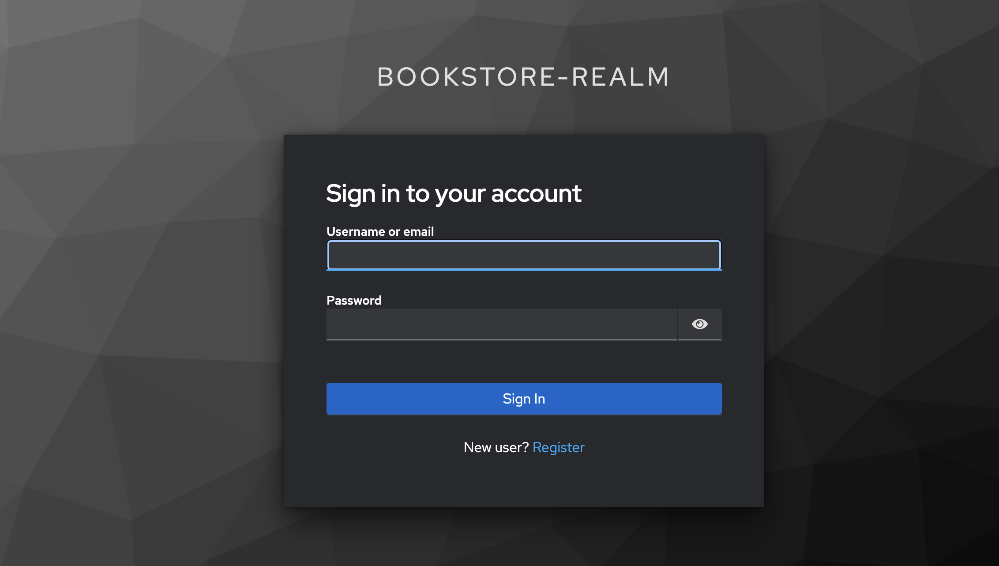
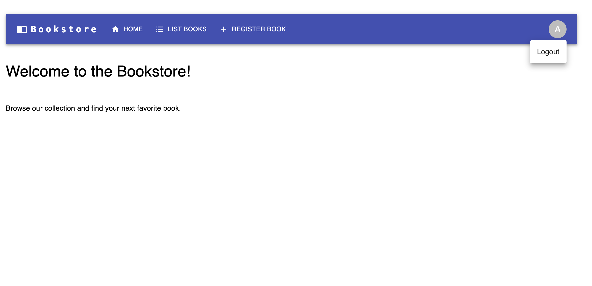
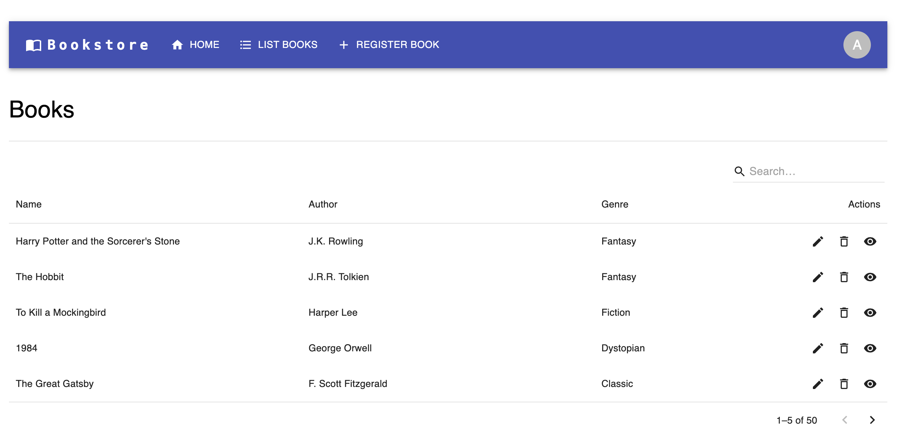
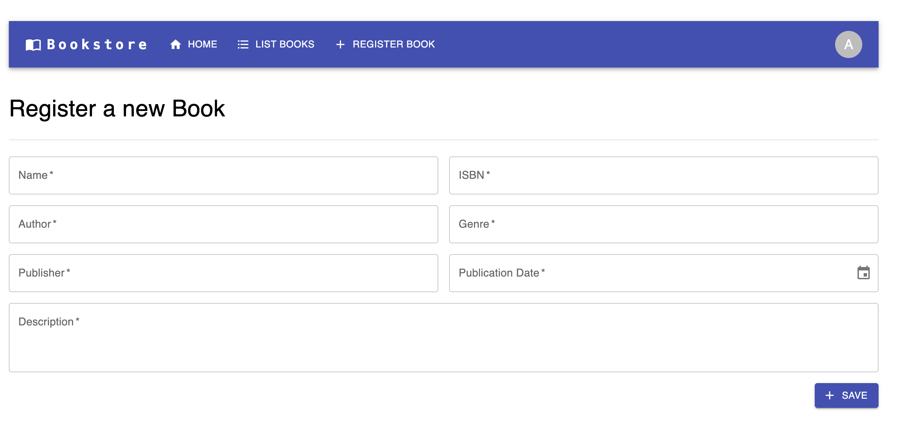
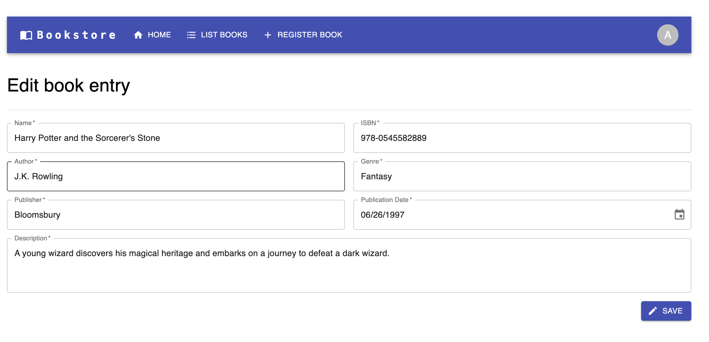
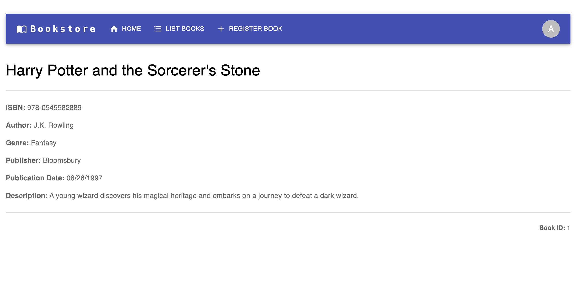

# Bookstore

Sample application for a bookstore. The main purpose of this project is to show a setup of modern frameworks interacting together.

## Overview

* Backend: Java, Spring Boot, Gradle, PostgreSQL, Flyway
* Frontend: React, MUI, Vite, React Hook Form, React Router, Jest
* Keycloak for authentication

## Screenshots

<details>

<summary>Screenshots</summary>

**Login**:


**Logout**:


**List**:


**Creation**:


**Edit**:


**Details**:



</details>

## How to run

```
docker-compose up --build
```

Also to set up the realm in Keycloak, you need to run the following command after keycloak was started:


```
./initialize-kc.sh
```

The frontend can be accessed via http://localhost:3000 and Keycloak can be accessed via http://localhost:8080.

You can login with to both, Keycloak and the frontend, via:
- Username: admin
- Password: admin

## Test

### Backend

```
./gradlew :backend:test
```

### Frontend
```
cd frontend
yarn test
```

### Integration
```
./gradlew :backend:integration
```